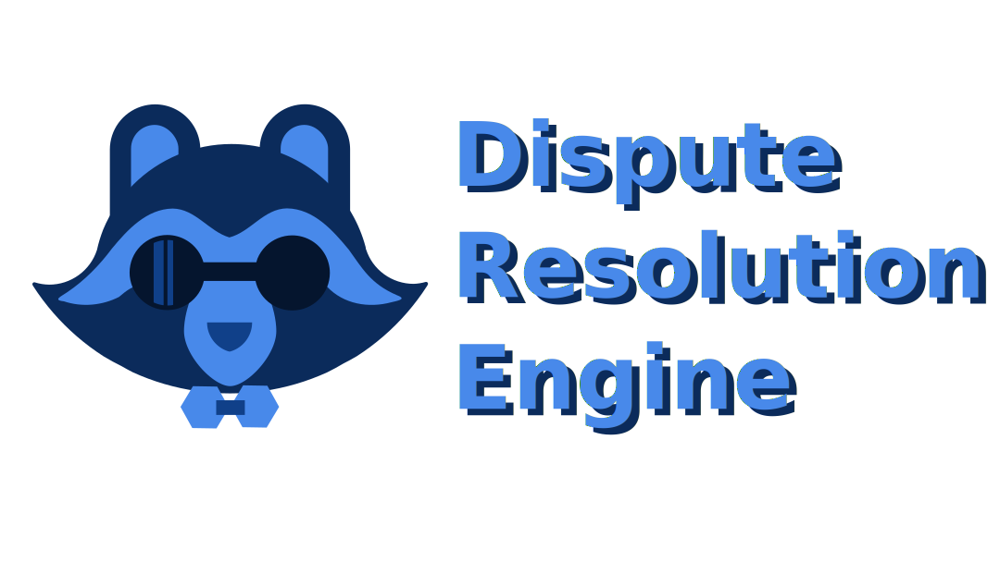

  

  
  
  
  

# Techtonic - Dispute Resolution Engine

COS301 Capstone Project for [Domain Name Services (Pty) Ltd](https://dns.business/).

Facilitating & enhancing dispute resolution processes with Natural Language Processing and Sentiment Analysis
 

# Meet the Team
Team Email: [the.techtonic.team@gmail.com](mailto:the.techtonic.team@gmail.com)

## Team Members

Sebastian Guimaraens - u22494767
 

When it comes to computing, I revel in security. I am fond of programming backend services, designing secure system architectures, as well as Blue Teaming.  I find purpose in combating cybercrime, a deep conviction to contribute to a safer digital realm. A keyboard and an internet connection is all I need to make a difference. Additionally I am on team waffles, we deserve better than pancakes.

  Email: u22494767@tuks.co.za

 

      

Vincent Feistel - u22563777
 

Description here

  Email: u22563777@tuks.co.za

 

      

Kivashin Naidoo - u22551167
 

Description here

  Email: u22551167@tuks.co.za

 

      

Michael Horwitz - u22512323
 

Description here

  Email: u22512323@tuks.co.za

 

      

Caelan Hill - u04643187
 

I'm a passionate developer who thrives on programming challenges, exploring the intricacies of artificial intelligence, and crafting immersive game experiences. I'm always open to collaboration and new opportunities, eager to create impactful solutions. I am a proud member of team pancakes, unlike some of our other team-members.

  Email: u04643187@tuks.co.za

 

      

 

# Tech Stack

## Frontend

## Backend

## Deployment

## Project Management

